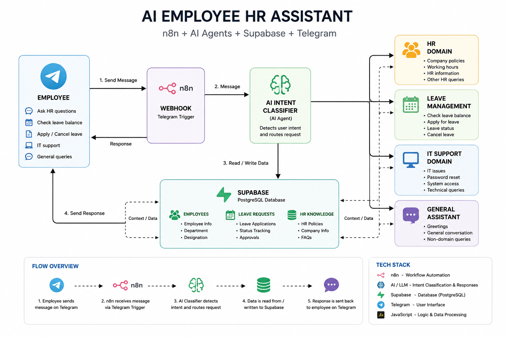

# AI Employee HR Assistant

An AI-powered employee assistant built with **n8n, AI Agents, Supabase (PostgreSQL), JavaScript, and Telegram**.

The system allows employees to interact with an AI assistant through Telegram for HR, leave-management, IT-support, and general queries. n8n handles workflow orchestration, AI intent classification, business logic, and database operations.

> **Note:** The production n8n workflow and credentials are intentionally not included in this public repository. The workflow can be demonstrated live during interviews.

## Architecture



## Key Features

### HR Assistant
- Company working hours
- HR information
- HR policies and FAQs
- General HR questions

### Leave Management
- Check leave information
- Submit leave requests
- Track leave status
- Cancel pending leave requests
- Store leave requests in Supabase
- Employee-specific request matching
- Pending / Approved / Rejected / Cancelled status handling

### IT Support
- Technical support questions
- Common IT assistance
- Password and system-access related queries

### General Assistant
- Greetings
- General conversation
- Non-HR queries

## How It Works

1. Employee sends a message through Telegram.
2. n8n receives the message using the Telegram Trigger.
3. An AI Agent identifies the user's intent.
4. n8n routes the request to the appropriate branch.
5. Specialized logic processes HR, Leave, IT, or General requests.
6. Supabase is used to read or write employee and leave data where required.
7. n8n prepares the final response.
8. The response is sent back to the employee through Telegram.

## Technology Stack

| Technology | Purpose |
|---|---|
| n8n | Workflow automation and orchestration |
| AI / LLM | Intent classification and natural-language responses |
| Supabase | PostgreSQL database and application data |
| Telegram | Employee-facing conversational interface |
| JavaScript | Data transformation and business logic |

## Project Highlights

- AI-driven intent routing
- Database-backed business logic
- Employee-specific leave operations
- Automated leave request creation and cancellation
- Multiple specialized assistant branches
- Error handling for unmatched requests
- Real-time interaction through Telegram
- Modular n8n workflow architecture

## Example Use Cases

**Employee:**
> What are the company working hours?

**Assistant:**
> The company working hours are Monday to Friday, 9:00 AM to 5:00 PM.

**Employee:**
> I want to take 3 days of Casual Leave from August 24 to August 26 for a family function.

The assistant validates the request and stores it as a `PENDING` leave request in Supabase.

**Employee:**
> Cancel my Casual Leave from August 24 to August 26.

The workflow searches for the employee's matching pending request and changes its status to `CANCELLED`.

## Repository Contents

```text
AI-Employee-HR-Assistant/
├── README.md
├── .gitignore
├── docs/
│   └── architecture.png
└── screenshots/
    └── .gitkeep
```

## Security

No API keys, passwords, Telegram bot tokens, Supabase credentials, or private configuration should be committed to this repository.

The actual n8n workflow is kept private and can be demonstrated live.

## Future Improvements

- Conversation memory
- Employee authentication
- Manager approval dashboard
- Email notifications
- Voice interface
- Web-based employee portal
- Production deployment
- Analytics dashboard

## Project Status

**Completed — Interview Demo Ready**

This project demonstrates practical experience with AI automation, LLM integration, workflow orchestration, database operations, API integrations, and business-process automation.
